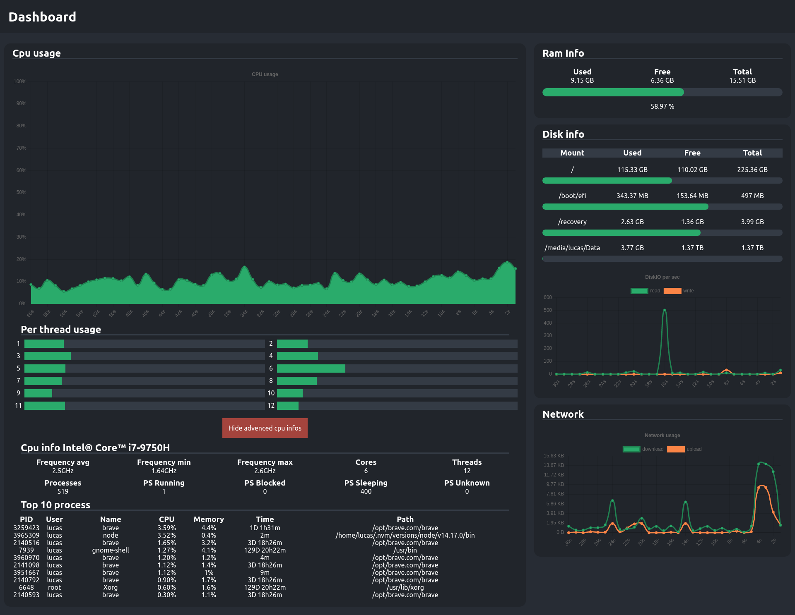

# :memo: Dashboard React application

## :rocket: Running project

```
git clone git@github.com:Lukylix/server-dashboard.git
git clone git@github.com:Lukylix/client-dashboard.git
cd server-dashboard
yarn start
cd ../client-dashboard
yarn start
```

## Screenshot


